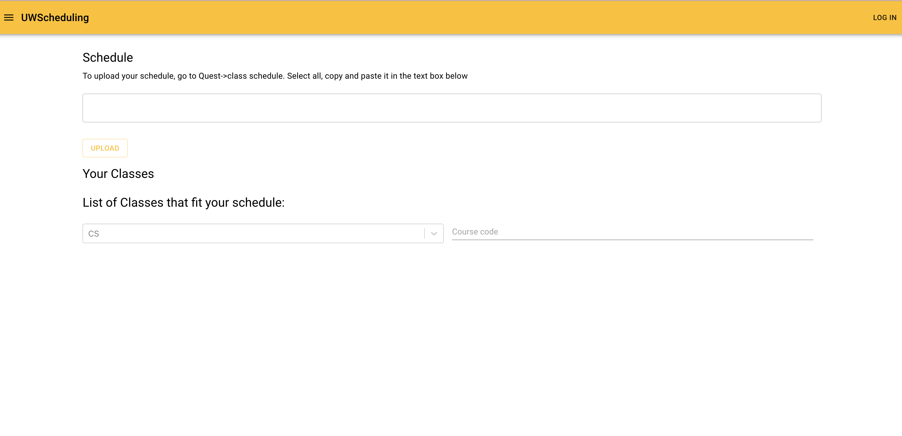

# uw-schedulemaker
A CS348 project\
\
Upload courses you took in the past and get suggestions on courses to take and more

# Group Members:
Ana Wan\
Sunny Yang\
Keat Chong\
Yuetong Wang
# For Developers
## To test the app locally
The README.txt of the backend and frontend repo shows the instruction to run the app.

## Database Creation
The queries for creating tables are located in the file /backend/database/createtables.sql.
The backend app will execute that sql file which creates the tables for the SQL database.

## Database Population
Using Google Cloud Shell and MySQL, the commands in /backend/database/sql/sampledataset.sql are executed manually.

## How the Web app receives data from the SQL database
The backend grabs the data from SQL database in gcp (via sqlalchemy) and sends that data to the web app whenever the webapp executes a GET request to the backend API (on /courses route).
The App can also send data to the backend using POST requests that will be used to update the table such as for adding a new
user to AppUser

## Web App link
https://cs348-webapp10.appspot.com/
Note: currently this does not work because our free trial for GCP expired.

## Backend API link
https://cs348-database10.appspot.com/courses
Note: currently this does not work because our free trial for GCP expired.

## How to populate local database with sample data

### For connecting to local database:

### Steps: 
`brew install postgresql`

`pg_ctl -D /usr/local/var/postgres start && brew services start postgresql`

`psql postgres`

Our database name is schedulemaker, type in this when posgres started:

postgres=# `CREATE DATABASE schedulemaker`

#### To run scripts for local database:

### You can try this:
python3 ./database/scripts/execute_sql.py -f createtables -u yourUsername -p yourPassword

### To Populate all data into local database:
python3 ./database/scripts/populate_tables.py -u yourUsername -p yourPassword

### To Populate specific table into local database:
python3 ./database/scripts/populate_tables.py -t 'table_you_want_to_populate' -u yourUsername -p yourPassword
